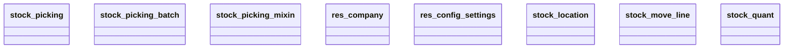

# Models

Detected core models and extensions in outgoing_routing.

Notes
- Classes show model technical names; fields omitted for brevity.
- Items listed under _inherit are extensions of existing models.
