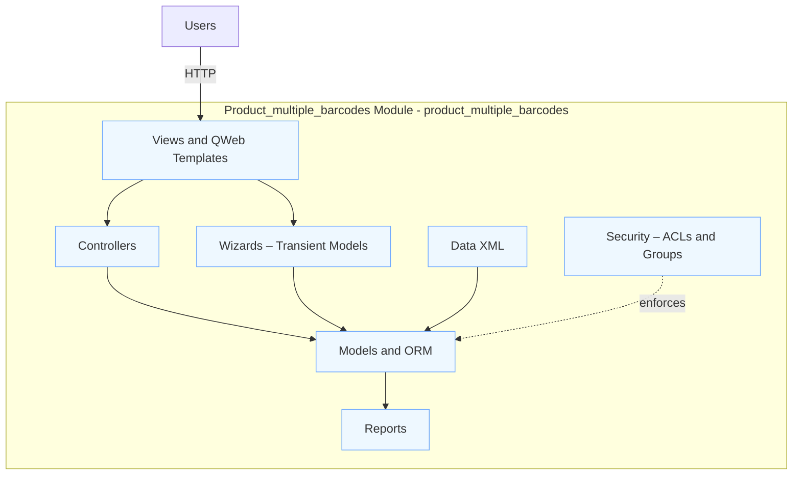

# Architecture

Notes
- Views include tree/form/kanban templates and report templates.
- Controllers provide website/portal routes when present.
- Wizards are UI flows implemented with `models.TransientModel`.
- Data XML loads data/demo records; Security defines groups and access.
